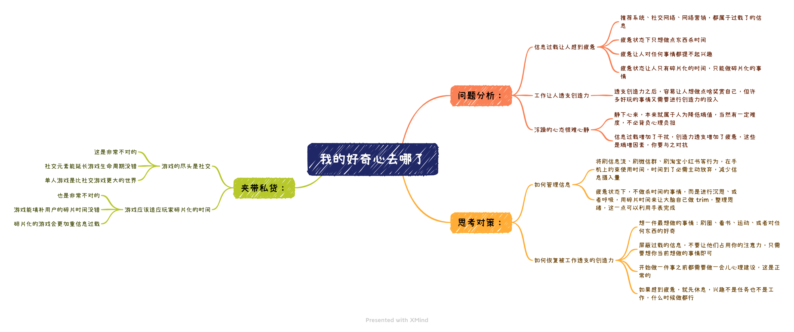

# 我的好奇心去哪了

## 问题分析：

- 信息过载让人感到疲惫
    - 推荐系统、社交网络、网络营销，都属于过载了的信息
    - 疲惫状态下只想做点东西杀时间
    - 疲惫让人对任何事情都提不起兴趣
    - 疲惫状态让人只有碎片化的时间，只能做碎片化的事情

- 工作让人透支创造力
    - 透支创造力之后，容易让人想做点啥奖赏自己，但许多好玩的事情又需要进行创造力的投入

- 浮躁的心态很难心静
    - 静下心来，本来就属于人为降低熵值，当然有一定难度，不必背负心理负担
    - 信息过载增加了干扰，创造力透支增加了疲惫，这些是熵增因素，你要与之对抗

## 思考对策：

- 如何管理信息
    - 将刷信息流、刷微信群、刷淘宝小红书等行为，在手机上约束使用时间，时间到了必需主动放弃，减少信息摄入量
    - 疲惫状态下，不做杀时间的事情，而是进行沉思、或者呼吸，用碎片时间来让大脑自己做 trim，整理思绪，这一点可以利用手表完成

- 如何恢复被工作透支的创造力
    - 想一件最想做的事情：刷圈、看书、运动、或者对任何东西的好奇
    - 屏蔽过载的信息，不要让他们占用你的注意力，只需要想你当前想做的事情即可
    - 开始做一件事之前都需要做一会儿心理建设，这是正常的
    - 如果感到疲惫，就先休息，兴趣不是任务也不是工作，什么时候做都行

## 夹带私货：

- 游戏的尽头是社交
    - 这是非常不对的
    - 社交元素能延长游戏生命周期没错
    - 单人游戏是比社交游戏更大的世界

- 游戏应该适应玩家碎片化的时间
    - 也是非常不对的
    - 游戏能填补用户的碎片时间没错
    - 碎片化的游戏会更加重信息过载
